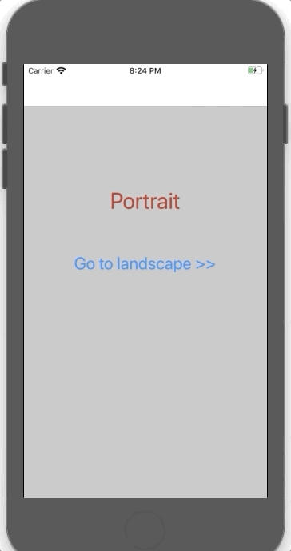
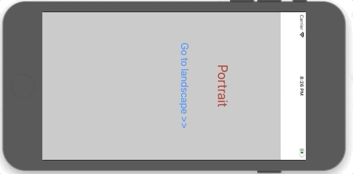

# FixedOrientation

* Fix orientation for a view as **'Portrait'**, and the other as **'Landscape'**.


## Notes:

**1.** In **'General'** tap, **'Device orientation'** section support both portrait and landscape. 
**2.** In **'General'** tap, **'Status Bar Style'** section select **'Requires full screen'**.


**3.** In **'AppDelegate.h/AppDelegate.m'** override **'supportedInterfaceOrientationsForWindow'** function.

```objective-c
#import <UIKit/UIKit.h>

@interface AppDelegate : UIResponder <UIApplicationDelegate>

@property (strong, nonatomic) UIWindow *window;

- (UIInterfaceOrientationMask)application:(UIApplication *)application
  supportedInterfaceOrientationsForWindow:(nullable UIWindow *)window;

@end

```


**4.** Set desired orientation in both **viewWillAppear/viewWillDisappear** for: 
  * Custom navigation controller.
  * Portrait and landscape viewControllers.
  
  **Portrait**
  ```objective-c
   [[UIDevice currentDevice] setValue:[NSNumber numberWithInteger: UIInterfaceOrientationPortrait] forKey:@"orientation"];
   ```
   
   **Landscape**
   ```objective-c
   [[UIDevice currentDevice] setValue:[NSNumber numberWithInteger: UIInterfaceOrientationLandscapeLeft] forKey:@"orientation"];
   ```
   
   
  ## Screenshots
  
    
  

